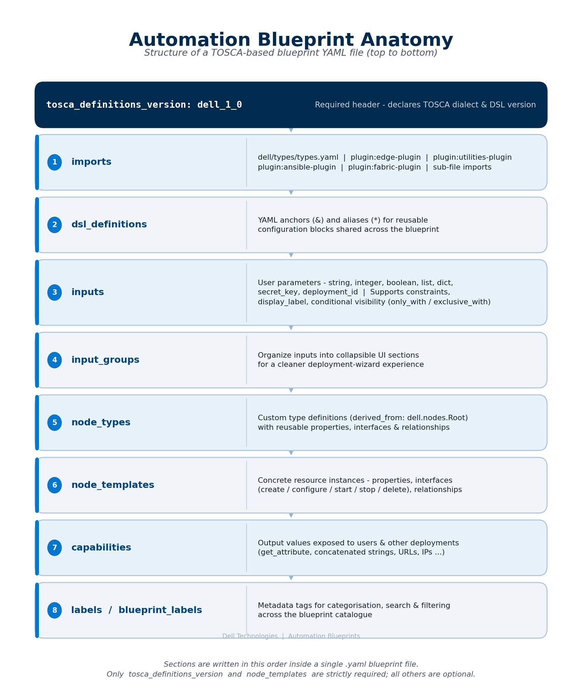
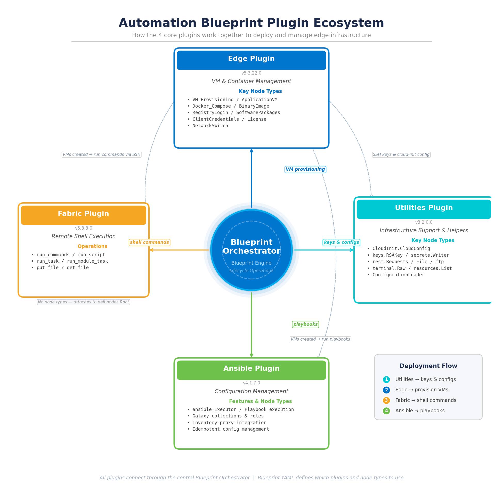
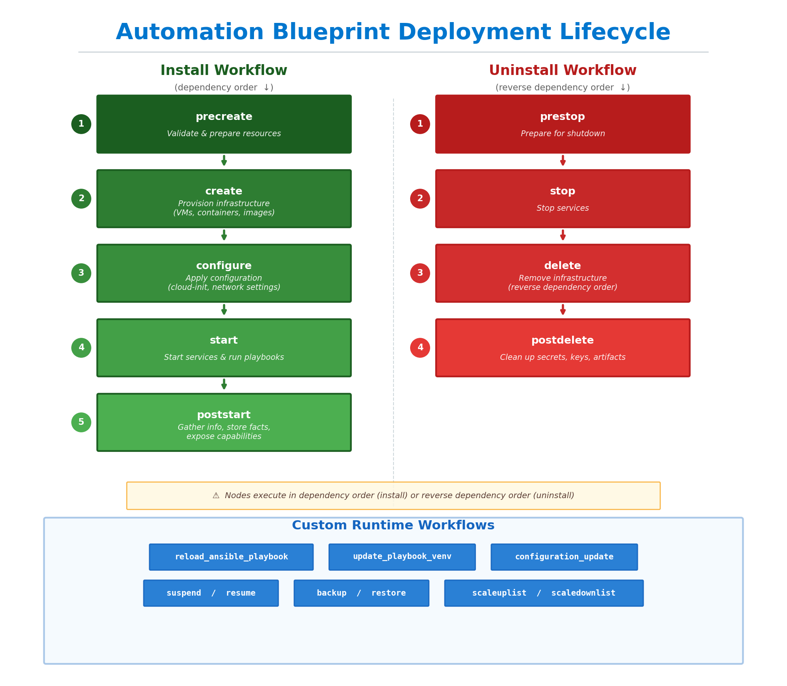
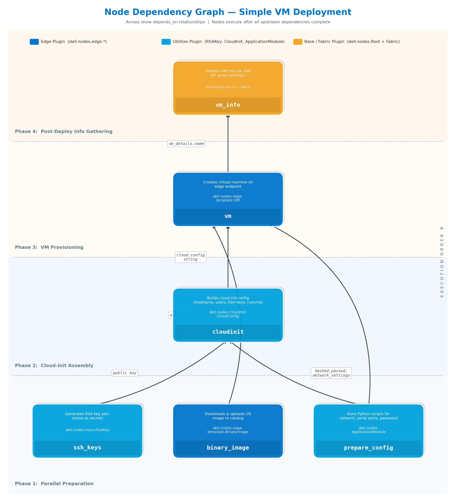
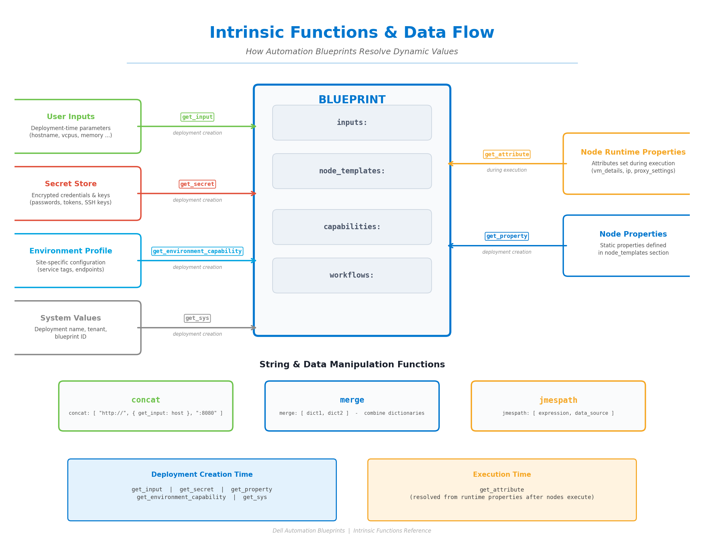
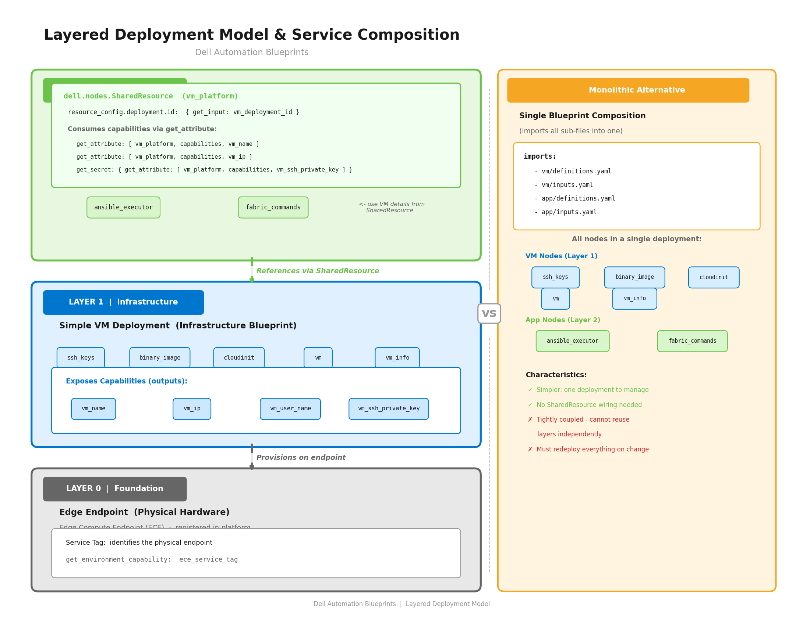
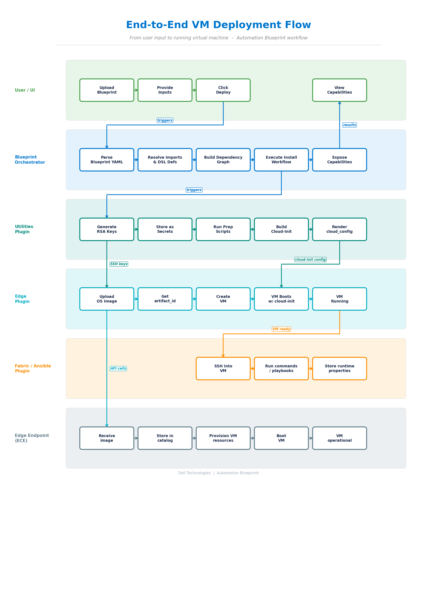
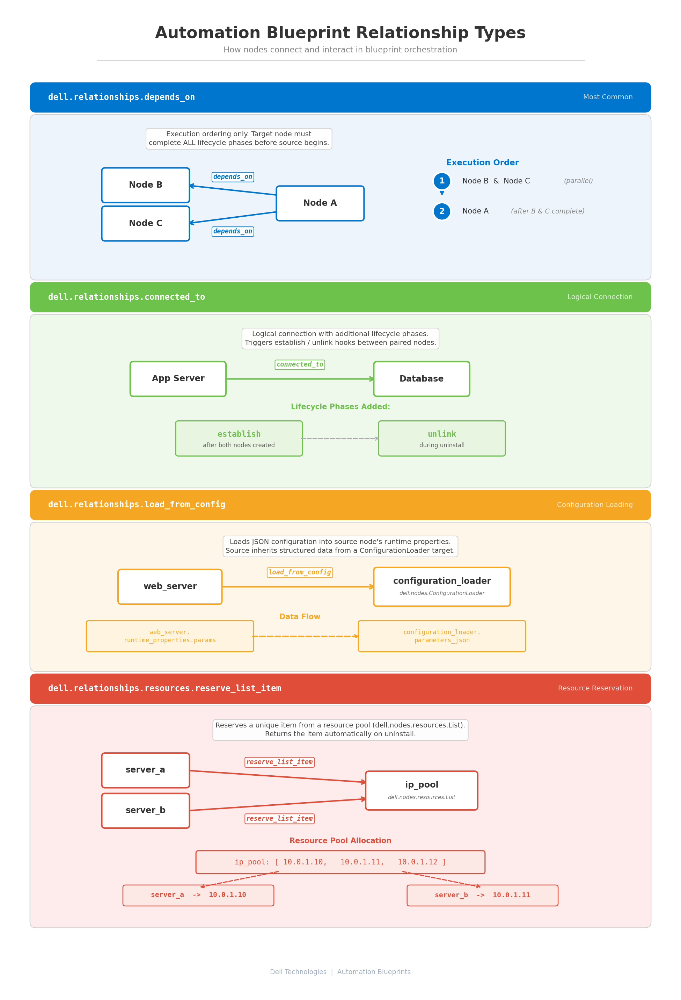

# Automation Blueprint Visuals

Graphical representations of the Automation Blueprint architecture, plugin ecosystem, deployment lifecycle, and data flow.

---

## Diagrams

### 01 - Blueprint Anatomy

Shows the structure of a TOSCA-based blueprint YAML file from top to bottom: `tosca_definitions_version`, `imports`, `dsl_definitions`, `inputs`, `input_groups`, `node_types`, `node_templates`, `capabilities`, and `labels`.

---

### 02 - Plugin Ecosystem

How the 4 core plugins work together through the central Blueprint Orchestrator:
- **Edge Plugin** (v3.3.22.0) - VM & container management
- **Utilities Plugin** (v3.2.0.0) - SSH keys, cloud-init, secrets, REST, files
- **Ansible Plugin** (v4.1.7.0) - Configuration management via playbooks
- **Fabric Plugin** (v3.3.3.0) - Remote shell execution over SSH

---

### 03 - Deployment Lifecycle

Side-by-side view of the Install workflow (`precreate` -> `create` -> `configure` -> `start` -> `poststart`) and Uninstall workflow (`prestop` -> `stop` -> `delete` -> `postdelete`), plus custom runtime workflows.

---

### 04 - Node Dependency Graph

Dependency graph for a typical Simple VM deployment showing 4 execution phases:
1. **Parallel Preparation** - ssh_keys, binary_image, prepare_config
2. **Cloud-Init Assembly** - cloudinit
3. **VM Provisioning** - vm
4. **Post-Deploy Info Gathering** - vm_info

Arrows show `depends_on` relationships and data annotations (public key, artifact_id, cloud_config string, etc.).

---

### 05 - Intrinsic Functions & Data Flow

How blueprints resolve dynamic values using intrinsic functions:
- **Deployment creation time**: `get_input`, `get_secret`, `get_property`, `get_environment_capability`, `get_sys`
- **Execution time**: `get_attribute`
- **Manipulation**: `concat`, `merge`, `jmespath`

---

### 06 - Layered Deployment Model

The three-layer deployment architecture:
- **Layer 0** - Edge Endpoint (physical hardware / ECE)
- **Layer 1** - Infrastructure Blueprint (VM deployment exposing capabilities)
- **Layer 2** - Application Blueprint (consuming Layer 1 via `dell.nodes.SharedResource`)

Also shows the monolithic alternative (single blueprint composition via imports).

---

### 07 - End-to-End VM Deployment Flow

Horizontal swimlane diagram showing the complete flow from user input to running VM across 6 lanes: User/UI, Blueprint Orchestrator, Utilities Plugin, Edge Plugin, Fabric/Ansible Plugin, and Edge Endpoint.

---

### 08 - Relationship Types

The 4 relationship types in Automation Blueprints:
1. **`dell.relationships.depends_on`** - Execution ordering (most common)
2. **`dell.relationships.connected_to`** - Logical connection with establish/unlink phases
3. **`dell.relationships.load_from_config`** - Configuration loading from ConfigurationLoader
4. **`dell.relationships.resources.reserve_list_item`** - Resource pool reservation
